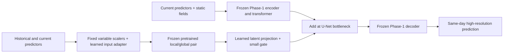

# Pretrained transfer takeover evidence (2026-09-15)

## Findings and scope

**The separate regional pretrained-transfer pathway has performed a real SA
optimizer update using verified Prithvi-WxC weights. Its scientific usefulness is
not evaluated or accepted.** The inherited `native_pair` comparison addresses the
architectural hypothesis; it must not be reinterpreted as proof of pretrained
transfer.

Evidence is under `artifacts/temporal_takeover/20260915T113310/`. Existing archived
experiment records are preserved. Corrections are marked in the original research
and native-pair documents and in the SA YAML comments.

## Current loading versus historical provenance

The current ECCC checkpoint has transformer width 2560; the SA Phase-1 checkpoint
has width 1024. Direct state inspection finds 199 common keys, 15 compatible keys,
and 184 mismatches, including every one of the 170 backbone tensors. Compatible
learned parameters are 10,779,013 / 246,408,968 across the model and **0 /
214,066,176 in the backbone**, excluding normalization tensors. See
`phase1_provenance_correction.json` and `pretrained_assets.json`.

This establishes **current incompatibility**. It does not conclusively establish
historical random initialization:

- The Phase-1 checkpoint records epoch 9, global step 4570, commit
  `50982b82788aac19b354190b9a41dbbd4f6d76ec`, branch `CORDEX_ML_diffusion_head`,
  and a **dirty source tree**. Its initializer metadata names the current ECCC
  file and records SHA256
  `e15c6a55f8c04edd55f3441fc2da49013d8dfce4b63f7c0952206c268e01b02d`.
- The recorded commit's loader filters mismatched shapes; its resolved config
  disables resume. These support an inference that this recorded path would
  initialize the backbone without ECCC weights. The dirty source modifications
  and actual load report were not retained; replaying the clean commit does not
  recover those missing facts.
- The historical SA fine-tuning notebook explicitly saved: `Loaded 198 tensors`
  from Linux `.../ECCC/weights/best_rmse_UNET_small.pt`, with 10 skipped entries.
  This is evidence of a different, substantially compatible initialization in a
  related workflow, **not proof that this particular Phase-1 run used it**.
- No smaller file or documented distillation/dimension-reduction chain was found
  in the inspected model assets and repository code/docs. The preserved Phase-1
  run's logs directory is empty. Earlier initialization remains **unresolved**.

The notebook extracts and recorded loader are saved in
`historical_notebook_initializer_evidence.json` and
`phase1_recorded_commit_loader.py`. A histogram resembling random initialization
cannot establish that a time map never trained or has no useful information.

The Phase-1 metadata also records training on the entire 1961–1980 + 2080–2099
archive with validation disabled. Temporal validation dates 1977–1980 are therefore
exposed to Phase-1 training. Identical exposure across candidates does not prove
its effect cancels. Fixed scalers remain unchanged; 1981–1983 test dates are
separately identified.

## Verified assets and primary sources

The official API response is saved in `official_checkpoint_revisions.json`.

| Asset | Local status | Source revision |
|---|---|---|
| ECCC `best_rmse_UNET.pt` | 17,384,534,215 bytes; downstream checkpoint | `7153a0260c482bdceb3b6edcae731321a04c8f3d` |
| Rollout `prithvi.wxc.rollout.2300m.v1.pt` | Two local copies, each 28,447,289,145 bytes; selected copy fully SHA256-verified | `53cce4de1e1500dbce42283eae6242e73f60f8a1` |
| General `prithvi.wxc.2300m.v1` | Not present in the inspected local Prithvi assets | Not downloaded; no new asset required for this bounded branch |
| `best_rmse_UNET_small.pt` | Referenced by historical notebooks; unavailable locally | Unknown |

Rollout copy used:
`D:/Prithvi-WxC/data/weights/large_rollout/prithvi.wxc.rollout.2300m.v1.pt`.
Verified SHA256:
`e66ef85d4e404465a5359b729f115d4bd7a5c5e8016c7b86b5f773d72cef8efa`.

The [official implementation](https://github.com/NASA-IMPACT/Prithvi-WxC),
[IBM downscaling repository](https://github.com/IBM/granite-wxc),
[model card](https://huggingface.co/ibm-nasa-geospatial/Prithvi-WxC-1.0-2300M), and
[paper](https://arxiv.org/abs/2409.13598) were checked. The general checkpoint
combines masking and forecasting with variable intervals and zero/nonzero leads;
the rollout checkpoint underwent further training with six-hour intervals and
leads. That cadence difference is an adaptation limitation, not a proof that
rollout representations cannot transfer.

## Executable integration

`granitewxc/temporal/transfer.py` implements `regional_rollout_pair_transfer_v2`.
It loads **complete transformer modules 0 and 1** from the encoder at the original
2560-dimensional width, followed in native local-then-global attention order.
The output transpose restores the original global/local axis order. No learned
matrix is narrowed from 2560 to 1024. Source defaults have no shifted-window
operation; later encoder and all decoder modules are explicitly excluded.

| Component | Classification |
|---|---|
| Frozen first local/global pair, 157,332,480 parameters | Directly foundation-pretrained, exact source keys/shapes |
| Frozen input/lead time maps, 2,560 parameters | Directly foundation-pretrained; no usefulness inferred from histograms |
| Existing SA Phase-1 encoder, transformer, decoder | Downscaling-trained, unresolved earlier foundation provenance |
| Regional input projection, normalization layers, latent projection, gate; 2,795,008 parameters | Newly initialized and optimized; normalization here is in latent space, not physical-unit scalers |
| Input and output scalers | Fixed original Phase-1 normalization; never optimized |
| Input semantics, token grid, finite-depth truncation, latent injection | Intentionally adapted |



### Data and geometry contract

- Only real historical and current predictors are inputs. Their concatenated
  normalized values interact in the new input projection **before** entering the
  reused attention modules. The output is a contemporaneous downscaling field.
- SA uses `u,v,q,t,z` at the three existing pressure levels: 15 variables in the
  original order. These are daily means. The actual 24-hour timestamp difference
  is verified; **native model input time is +24 h**, and main lead is 0 h.
  The upstream SampleSpec computes current minus historical time; negative
  constructor offsets in examples are not the tensor handed to the model.
  Daily means are not relabeled as instantaneous six-hour MERRA-2 states.
- NARR uses atmospheric indices 0–14 and validity indices 16–30. Elevation at 15
  and its mask at 31 remain in the original Phase-1 path. A mask value of one is
  valid, matching `narr_prism_dataset.py`. The branch pools only valid values and
  carries valid coverage as explicit adapter inputs; masks are not weather targets.
- Native 160-channel MERRA-2 patch embedding, climatology, and scalers are excluded.
  Missing MERRA-2 channels are never manufactured. A new learned projection maps
  the reduced-variable regional domain to the latent feature dimension.
- The branch averages to 8×8 regional tokens, partitions them into 2×2 local
  groups and a 4×4 global grid, and adds newly represented relative regional
  coordinates. This explicitly changes geographic geometry and has not been
  validated as equivalent to native global pretraining geometry.
- The projected correction enters the unchanged Phase-1 U-Net bottleneck. The
  latent output initialization and gate are small, nonzero values. The original
  one-timestamp prediction remains available with `use_branch=False`.
- Frozen pretrained operations retain autograd. Upstream input adapters receive
  gradients through the reused pair. Frozen foundation parameters do not update.
- Verification-target values are not passed into the inherited model: output
  geometry comes from the configured/data-adapter crop. Missing/discontinuous
  history is rejected. No implicit cold-start duplication is performed.

`audited_pretrained_load` in `granitewxc/models/model.py` reports matched keys,
learned parameter coverage, buffers, and fixed normalization separately. Legacy
loading prominently warns when zero backbone parameters load. New configurations
claiming transfer must use `require_pretrained_backbone: true`; the separate
branch always requires complete loading of the selected component and a matching
file SHA256. Failure occurs before partial parameter mutation.

## Real-data execution and saved state

**Transparent correction:** the first three `*_v1` engineering audits used the
wrong negative sign for the pretrained input-time tensor. They are preserved,
including archived source `transfer_v1_negative_time_archived.py`, and invalidated
for the declared native conditioning contract. Upstream `SampleSpec` returns a
positive current-minus-history difference. The corrected `v2` module and source-
referenced sign regression use +24 h. Bounded audits are rerun in new directories;
pre-fix/post-fix evidence is never pooled. The next paragraph records the archived
first run only; the mechanical v2 comparison is authoritative for corrected work.

The initial SA audit completed one optimizer update on predictors
**1972-02-14 12:00 → 1972-02-15 12:00**, targeting 1972-02-15. It uses the unchanged
existing downscaling loss. Seven dates are loaded by the inherited window adapter,
but the transfer prediction uses only the final pair.

`transfer_sa_update_v1/update_audit.json` records:

- All nine newly trainable tensors changed; maximum input-projection change
  `9.2063e-5`. Input-projection gradient maximum `1.1601e-7`.
- Original Phase-1 and pretrained-pair state digests stayed identical.
- History changes predictions by up to `3.05176e-5` in the saved output tensor;
  target-only perturbation changes predictions by **0**.
- Maximum departure from the saved Phase-1 prediction: `0.00122547`.
- Optimization and comparison runtime: 167.469 seconds on CPU.

This is optimization and causality evidence, **not a skill estimate**. There has
been no held-out scientific transfer scorecard. The history effect is small and
must not be promoted as useful atmospheric information on this evidence alone.

`adapters.pt` saves the learned branch, immutable branch scalers, optimizer state,
source digests, update counter, and RNG state. Large immutable Phase-1/foundation
weights remain referenced in place. **New saves use checkpoint format v3**, while
the corrected experiment/configuration remains `regional_rollout_pair_transfer_v2`.
The save records the active pair's initialization mode, complete tensor-state
SHA256 (names, shapes, dtypes, values), width/head/MLP architecture, and positive
input-time/zero-lead convention. `restore_transfer_adapters` checks this actual
representation identity, source/Phase-1 identity, scaler, shape, keys, and channel/
geometry contracts before changing parameters or optimizer state. Unit tests
compare restored predictions and optimizer moments for both initialization modes.
**Exact data-order resume of this separate audit runner is not implemented**;
the checkpoint says so. Native-pair's production resume workflow is separate.

A final review reproduced a **v2 restoration defect**: identical foundation-file
hashes and geometry did not identify the active frozen pair. An adapter could
silently load over differently randomized weights or across random/pretrained
modes. A CPU toy fixture accepted different pair-state digests and changed its
prediction by `5.0404e-6`; this demonstrates the serialization error, not a new
scientific result. Evidence: `transfer_restore_identity_bug_reproduction.json`.

The preserved real v2 `adapters.pt` artifacts lack this active-state identity.
The new loader **rejects v1/v2 explicitly and requires a separately validated
migration**; changing the schema label or trusting the old config alone is not
sufficient. No migration or extra real-data training was performed. Earlier
saved predictions, optimizer updates, frozen-state checks, and engineering
verdicts remain preserved; they are not reclassified by this restore-only fix.
Cross-mode, same-mode/different-weight, architecture-mismatch, and missing-identity
checks fail before state mutation. Existing real v2 files are also checked for
this explicit legacy rejection in `transfer_restore_identity_validation.json`.

## Commands and controls

Use the Prithvi interpreter from the repository root:

```powershell
& 'C:/Users/huikyole/AppData/Local/miniforge3/envs/Prithvi/python.exe' -m granitewxc.temporal.transfer --config examples/CORDEX_ML/sa_regional_pretrained_transfer_v2.yaml --output artifacts/transfer_sa_new_run --device cpu --updates 1
```

The equivalent NARR configuration is
`examples/NARR_PRISM/narr_regional_pretrained_transfer_v2.yaml`, preserving
`case_name: narr_prism_California`, `ppt,tmax,tmin`, and Phase-1 hurdle decoding.
Real NARR execution remains blocked by the existing Linux-targeted data/scaler/
checkpoint assets; the integration does not replace symlink stubs. Override the
base YAML and explicit source path on a host where those assets exist.

The active examples retain **one current pretrained-transfer YAML per case**:
the SA and NARR v2 files above. Fourteen surplus YAMLs (the two obsolete v1 bases
and twelve standalone control files) were archived with verified hashes under
`artifacts/config_cleanup_20260915/archived_yaml/examples/`; the inventory is
`artifacts/config_cleanup_20260915/cleanup_manifest.json`. Existing audit records
and their original embedded configurations remain preserved.

Run controls using the same case YAML and a distinct `--output` directory:

| Control | Options added to the command above |
|---|---|
| Pretrained, observed history | `--initialization pretrained --history-mode observed` |
| Random pair, observed history | `--initialization random_control --history-mode observed` |
| Pretrained, duplicated current | `--initialization pretrained --history-mode duplicate_current` |
| Random pair, duplicated current | `--initialization random_control --history-mode duplicate_current` |

An omitted option uses its YAML value. The effective configuration, including
both selected controls, is saved in `update_audit.json` and `adapters.pt`.
Overrides retain adapter initialization, training data, loss, geometry, and
trainable capacity. `duplicate_current` is a synthetic ablation. The randomized
pair has the same frozen capacity and time-map architecture with different
initialization. Equal parameter counts do not imply equal information or actual
compute. Auxiliary supervision is absent in all four; future auxiliary
experiments require another matched factor.

The initial engineering audit accepts only 1–10 optimizer updates; it never
launches a sweep or the inherited 600-update experiment. Existing stochastic
refinement interfaces remain intact, but changed Phase-1 predictions do not
establish calibration of old refinement checkpoints.

## Current validation status

Focused transfer tests cover strict coverage failures, immutable normalization,
frozen-transformer gradient transmission, meaningful input-adapter updates,
validity-aware pooling, independent Phase-1 parity, target-only perturbation,
missing/discontinuous history, pinned required configurations, native time sign,
and saved adapter/optimizer reconstruction. See `transfer_tests_v2_final.log` (19 passed: 13 transfer and 6 Phase-1 fold tests).

All three corrected one-update CPU audits completed and exited successfully.
Their mechanical comparison is recorded in `transfer_engineering_comparison.json`. No transfer candidate is
scientifically accepted. Next scientific work requires a separately budgeted,
validation-selected comparison across these matched controls, with the inherited
Phase-1 exposure limitation carried forward.

## Corrected v2 control results (generated from saved artifacts)

| Initialization / history | Optimizer updates | All adapter tensors changed | Frozen Phase-1 / pair unchanged | Target perturbation | pr history difference (mm/day) | tasmax history difference (K) |
|---|---:|---|---|---:|---:|---:|
| pretrained_observed | 1 | True | True / True | 0 | 1.33514e-05 | 3.05176e-05 |
| random_observed | 1 | True | True / True | 0 | 1.43051e-05 | 3.05176e-05 |
| pretrained_duplicate_current | 1 | True | True / True | 0 | 1.00136e-05 | 3.05176e-05 |

The mechanically checked initial-adapter digest, Phase-1 digest, source-file hash,
input/target dates, and trainable parameter count all match across these three
runs. The randomized frozen representation is explicitly not pretrained. All use
the same original downscaling loss and one target sample. The fourth factorial
cell (random + duplicate-current) was configured but not executed; it remains
available through the command-line controls above. NARR real-data
transfer remains asset-blocked. No transfer process remains active.

The small nonzero history differences also occur with the random representation.
This is evidence of working history-dependent optimization and a functioning
pretrained-weight path, not evidence that pretraining improves downscaling. A
single float32 temperature output increment can account for the reported maximum;
no atmospheric skill claim is made from that sensitivity. All scientific transfer
verdicts remain **incomplete / not accepted**.

Final regressions: 19 tests passed for transfer + Phase-1 fold loading, followed
by 13 transfer tests passed after adding explicit checkpoint variable-selection
and token-geometry validation (`transfer_tests_v2_contract.log`). Reordered
atmospheric channels cannot silently reuse an adapter checkpoint.


Checkpoint identity follow-up: `transfer_tests_v3_identity.log` records **23 passed**
after binding adapter saves to their actual frozen representation. All three real
v2 adapter artifacts were explicitly rejected before model mutation; their file
SHA256 values were unchanged (`transfer_restore_identity_validation.json`).
This source change affects checkpoint save/restore validation only; the three
corrected real-data v2 audit results above were not rerun or pooled with new runs.

Configuration consolidation validation: **30 transfer tests passed** in
`transfer_tests_config_consolidation.log`; `--help` exposes both control options.
All four controls resolve from each retained case YAML, omitted options preserve
YAML values, and checkpoints record the effective selection. No real-data
training was launched for this cleanup.
